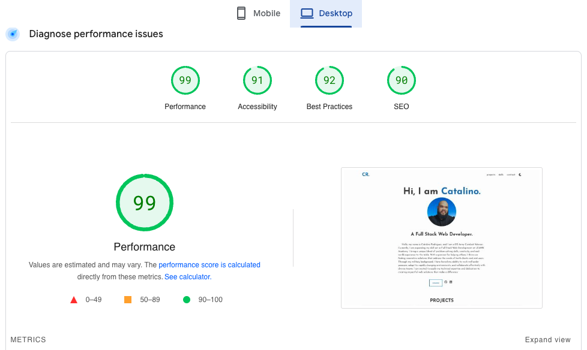

# Portfolio V1 built with Html, CSS and Javascript only. (REDID WHOLE PORTFOLIO IN GATSBY)

[Gatsby/Tailwind Version](https://github.com/RodCato/Gatsby-Tailwind)

[My portfolio is live!](https://rodcato.github.io/portfolio/)

My portfolio is a work in progress but so far I am super happy with the page insights. 

V2 of my portfolio took all the same attributes as V1 but with Gatsby I was able to make it component based. All the sections on V2 are a new component. This makes it way more flexible to make adjustments and change you. I also used tailwindcss. 
